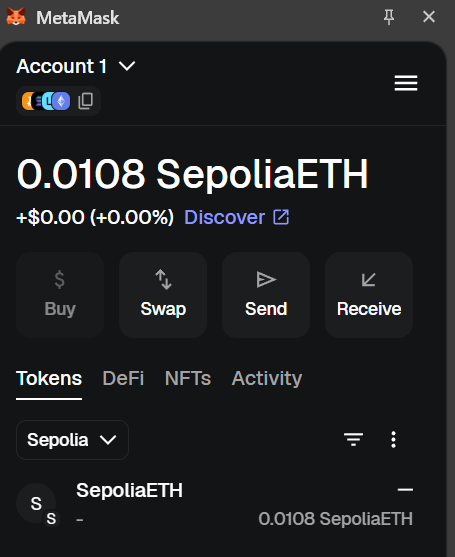
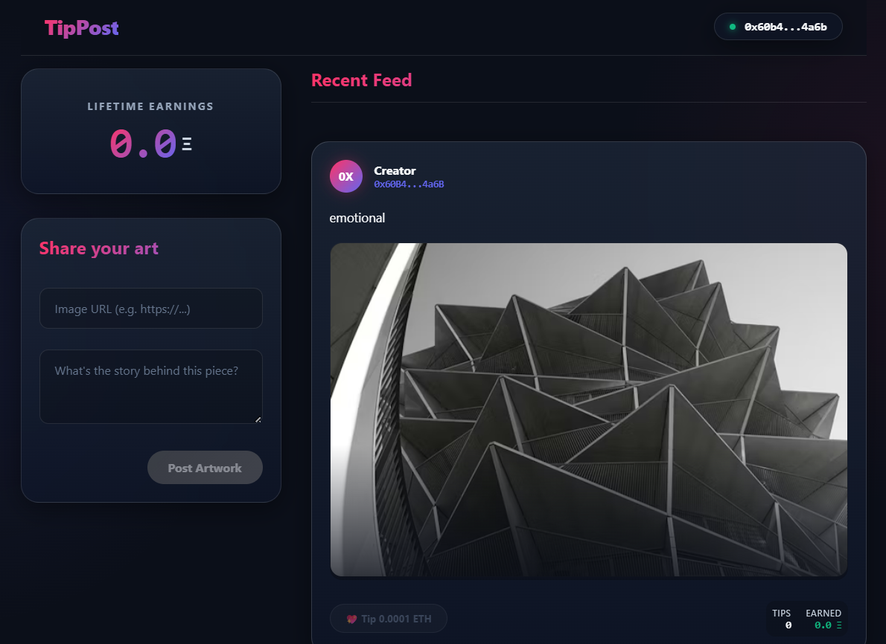
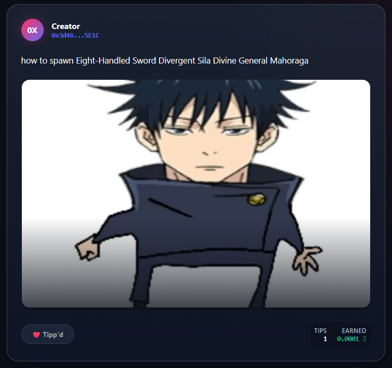
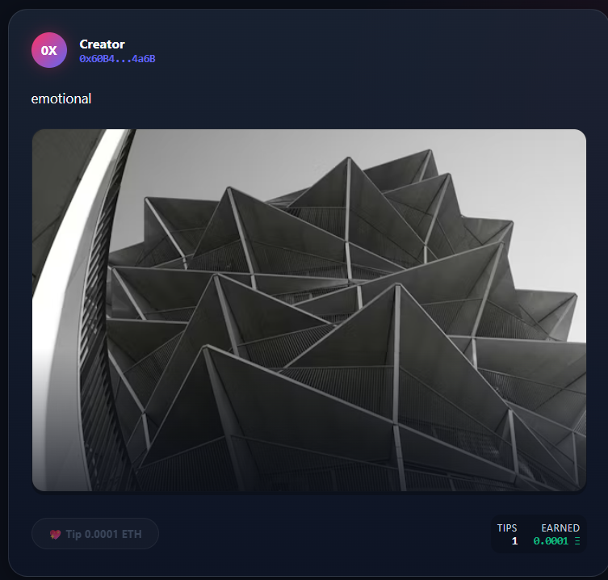
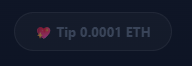
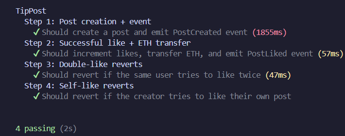

# TipPost dApp

A decentralized tip-based social media platform.

## Tech Stack

- **Smart Contracts**: Hardhat, Solidity, TypeScript, Ethers.js
- **Frontend**: Vite, React, TypeScript, Ethers.js v6

## Folder Structure

- `contracts/`: Smart contract project (Hardhat).
- `frontend/`: Vite-based React frontend.

## Local Setup

### Contracts

1. Navigate to `contracts/`.
2. Install dependencies: `npm install`.
3. Copy `.env.example` to `.env` and fill in the keys.
4. Compile: `npx hardhat compile`.
5. Test: `npx hardhat test`.

### Frontend

1. Navigate to `frontend/`.
2. Install dependencies: `npm install`.
3. Copy `.env.example` to `.env` and fill in the keys.
4. Run locally: `npm run dev`.

## How to Get Sepolia ETH

- [Alchemy Sepolia Faucet](https://sepoliafaucet.com/)
- [Infura Sepolia Faucet](https://www.infura.io/faucet/sepolia)
- [Google Cloud Sepolia Faucet](https://cloud.google.com/application/web3/faucet/ethereum/sepolia)

## Deployed Links

- **Contract Address (Sepolia)**: `0x58979D541C0A365899D7a74Dd2Bab3384c6fBAb6`
- **Frontend App**: https://mamosto-tip-post-midterms.vercel.app/

## Features Implemented

- **Smart Contract**: Functional `TipPost.sol` with post creation and tipping logic. Includes input validation and events.
- **Real-time Updates**: Frontend uses Ethers.js event listeners to refresh the feed automatically when new posts or likes are detected on-chain.
- **Dark Mode**: Implementation of a sleek, premium dark theme using CSS variables.
- **Earnings Dashboard**: Personalized view of ETH earned from tips.
- **Responsive Feed**: Clean, list-based layout for posts with image error fallbacks.

## Submission Screenshots Checklist

- [x] Live URL open in browser with MetaMask (Sepolia)
      
- [x] Post creation visible in feed
      
- [x] Tip transaction (0.0001 ETH) in MetaMask
      
- [x] Like count and earnings updated
      
- [x] Self-like/Double-like error message (opted to disable the action in the first place to avoid the error)
      
- [x] Hardhat tests passing (npx hardhat test)
      
